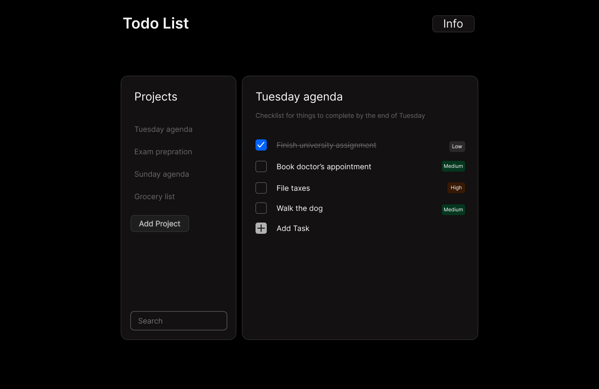

# Todo-List-App

## Concepts and Design Patters that I want to implement:
- Classes
- Composition over Inheritence 
- Modules
- Single Responsibility Principle, Open-Closed
- Observer Pattern (PubSub)

## Requirements and Functionality
- Create Projects/Folders *
    - Create To-do List (Single Page) *
        - Add To-do Items *
            - Modal dialog box
            - Add Title, Description, Priority, Deadline
            - Checkbox for completion of task [strike through style when completed]
        - Delete To-do Items *
        - Sort Items based on attributes
     - Move To-do List to another Project/Folder

- Remove/Rename Projects/Folders *

- Drag & Drop API for To-do Lists

## UI Layout

## Code Structure

Create Todo item class {title, description, dueDate and priority} | Module
Create Project class { todoLists[], description } | Module
Create DomController Class | Module

Main Logic:

